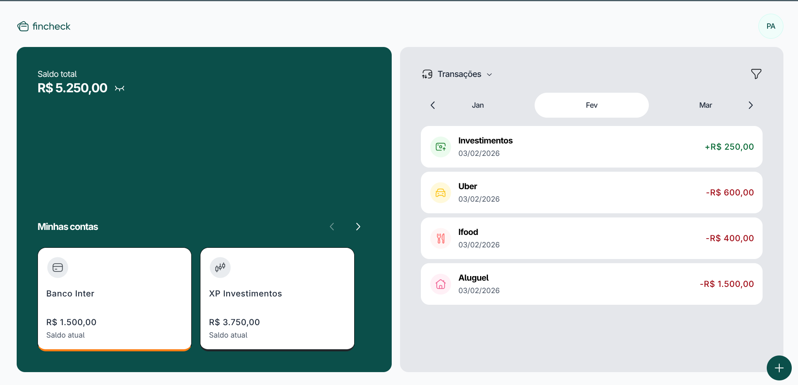
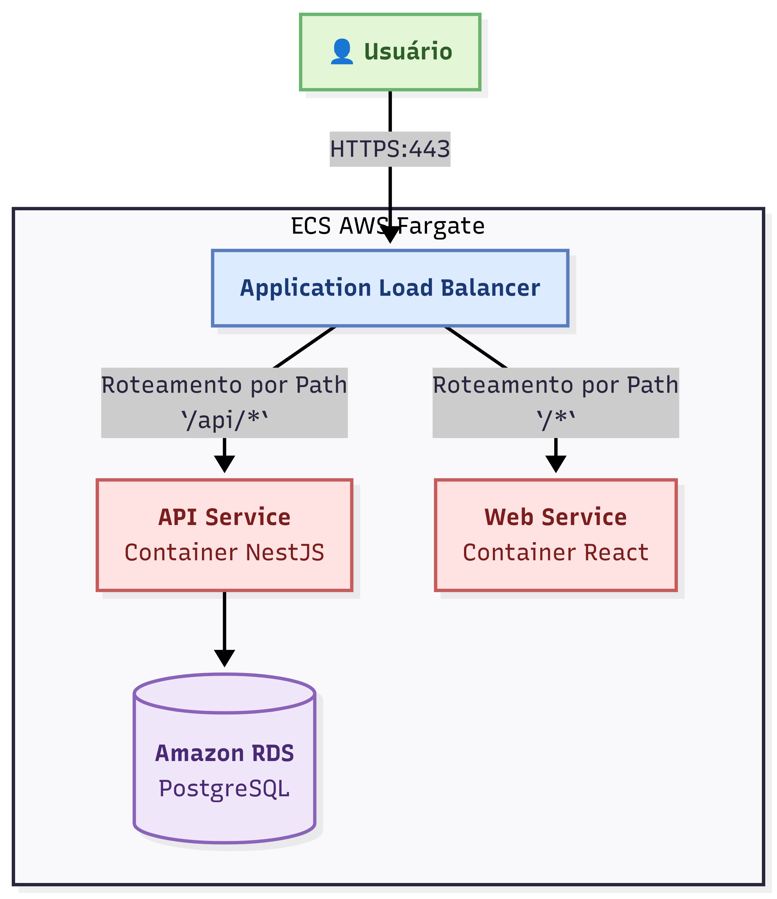

# Fincheck

<p align="center">
  
</p>

<p align="center">
  <strong>Controle suas finanças pessoais de forma simples e intuitiva.</strong>
</p>

<p align="center">
  
  
  
  
  
</p>

O Fincheck é uma aplicação de controle de finanças pessoais que permite aos usuários gerenciar suas contas bancárias, acompanhar transações e visualizar um dashboard completo de suas finanças.

## Screenshots

<p align="center">
  
</p>

## Funcionalidades

- ✅ **Dashboard Interativo**: Visualize um resumo de suas finanças em um só lugar.
- 🏦 **Gerenciamento de Contas**: Adicione, edite e remova contas bancárias de diferentes tipos (Corrente, Investimento, Dinheiro).
- 💸 **Controle de Transações**: Registre suas receitas e despesas com categorias personalizadas.
- 📊 **Filtros Avançados**: Filtre suas transações por conta, tipo e período.
- 🔐 **Autenticação Segura**: Proteja seus dados com autenticação baseada em JWT.

## Tecnologias Utilizadas

- **Frontend**: React, TypeScript, Vite, Tailwind CSS, React Query
- **Backend**: Nest.js, TypeScript, Prisma, PostgreSQL
- **Infraestrutura**: Docker

## Quick Start

Siga os passos abaixo para executar o projeto em seu ambiente local.

### 1. Pré-requisitos

- Node.js (v22+)
- Docker e Docker Compose

### 2. Clone o Repositório

```bash
git clone https://github.com/httpablo/fincheck.git
cd fincheck
```

### 3. Configure as Variáveis de Ambiente

Crie um arquivo `.env` na raiz do projeto e adicione as seguintes variáveis:

```env
# Configurações do Banco de Dados
DB_USER=user
DB_PASSWORD=passw@rd
DB_NAME=mydb

# URL de Conexão (usada pela API)
DATABASE_URL="postgresql://user:passw@rd@localhost:5432/mydb"

# Chave Secreta do JWT (usada pela API)
JWT_SECRET=sua-chave-secreta-aqui
```

### 4. Execute com Docker Compose

```bash
docker-compose up -d --build
```

### 5. Aplique as Migrations do Banco

```bash
docker-compose exec api npm run migrate:dev
```

A aplicação estará disponível em `http://localhost:8080`.

## Infraestrutura e Deploy

A infraestrutura do Fincheck foi projetada para ser escalável, segura e de fácil manutenção, utilizando os serviços da AWS. Todo o processo de deploy é automatizado com GitHub Actions.

### Arquitetura na AWS

A aplicação é executada em um ambiente serverless e containerizado, orquestrado pelo **Amazon ECS com AWS Fargate**.

O fluxo de uma requisição funciona da seguinte maneira:

<p align="center">
  
</p>

- **Application Load Balancer (ALB)**: Atua como o ponto de entrada único para todo o tráfego HTTPS. Ele é responsável por distribuir as requisições para o serviço correto com base no caminho da URL.
  - Requisições para `/api/*` são direcionadas ao container da API (Backend).
  - Todas as outras requisições (`/*`) são direcionadas ao container do Web App (Frontend).
- **Amazon ECS + Fargate**: A execução dos containers Docker de forma serverless. Cada serviço (API e Web) roda em seu próprio conjunto de containers, permitindo escalar ou atualizar cada parte da aplicação de forma independente.
- **Amazon RDS**: Gerencia o banco de dados PostgreSQL, garantindo backups, segurança e escalabilidade. O acesso é restrito por _Security Groups_.
- **Amazon ECR**: É o registro privado de containers, onde as imagens Docker da API e do Web App são armazenadas de forma segura após o processo de build.

### Pipeline de CI/CD com GitHub Actions

O processo de integração e entrega contínua (CI/CD) é 100% automatizado. Cada `push` na branch `main` dispara um workflow no GitHub Actions que executa os seguintes passos:

1.  **Build das Imagens Docker**: Constrói as imagens para o `web` e para a `api`.
2.  **Push para o ECR**: As imagens recém-construídas são enviadas para o Amazon ECR.
3.  **Deploy no ECS**: O workflow força uma atualização nos serviços do ECS, que realiza o deploy de forma gradual e sem indisponibilidade (**Zero Downtime Deployment**). O ECS primeiro sobe as novas versões dos containers e, somente após estarem saudáveis, ele para as versões antigas.

## Documentação Completa

Para mais detalhes sobre a arquitetura, endpoints da API e guias de desenvolvimento, consulte nossa [**documentação completa**](./docs/index.md).
