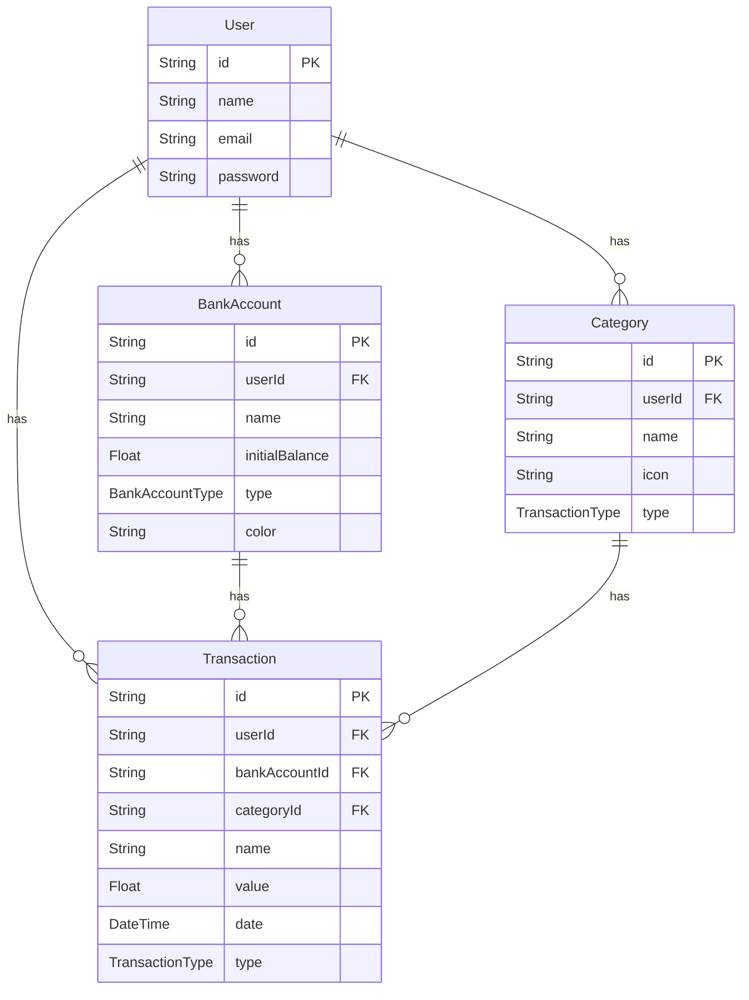

# Arquitetura do Fincheck

Este documento descreve a arquitetura do sistema Fincheck, incluindo a estrutura de diretórios, a modelagem de dados e a arquitetura geral do sistema.

## Estrutura de Diretórios

O projeto é organizado em dois diretórios principais: `api` e `web`.

### `api` (Backend)

O diretório `api` contém a aplicação Nest.js.

```
api
├── prisma/                 # Esquemas e migrations do banco de dados
│   ├── schema.prisma       # Definição do esquema do banco de dados
│   └── migrations/         # Arquivos de migração do banco de dados
├── src/                    # Código-fonte da aplicação
│   ├── app.module.ts       # Módulo raiz da aplicação
│   ├── main.ts             # Ponto de entrada da aplicação
│   ├── modules/            # Módulos da aplicação (Auth, BankAccounts, etc.)
│   │   ├── auth/           # Módulo de autenticação
│   │   ├── bank-accounts/  # Módulo de contas bancárias
│   │   ├── categories/     # Módulo de categorias
│   │   ├── transactions/   # Módulo de transações
│   │   └── users/          # Módulo de usuários
│   └── shared/             # Módulos e serviços compartilhados
│       ├── config/         # Configurações do projeto
│       ├── database/       # Módulo de banco de dados (Prisma)
│       └── ...
└── ...
```

### `web` (Frontend)

O diretório `web` contém a aplicação React.

```
web
├── public/                 # Arquivos públicos
├── src/                    # Código-fonte da aplicação
│   ├── app/                # Lógica principal da aplicação
│   │   ├── contexts/       # Contextos React
│   │   ├── entities/       # Tipos e entidades
│   │   ├── hooks/          # Hooks customizados
│   │   ├── services/       # Serviços de API
│   │   └── ...
│   ├── assets/             # Imagens, ícones, etc.
│   ├── view/               # Componentes de UI
│   │   ├── components/     # Componentes reutilizáveis
│   │   ├── layouts/        # Layouts de página
│   │   └── pages/          # Páginas da aplicação
│   └── ...
└── ...
```

## Modelagem de Dados (ERD)

O diagrama abaixo representa o relacionamento entre as entidades do banco de dados.


